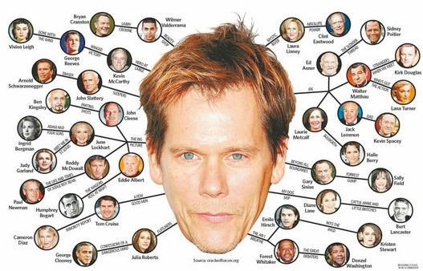
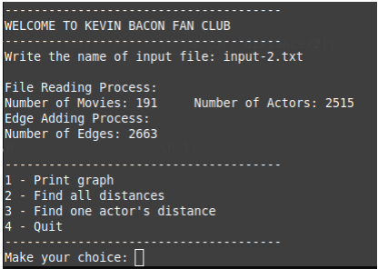
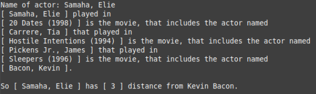
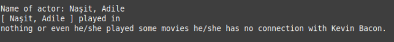
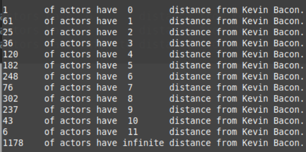

# Kevin-Bacon-Number
  "Six Degrees of Kevin Bacon or "Bacon's Law" is a parlour game based on the "six degrees of separation" concept, which posits that any two people on Earth are six or fewer acquaintance links apart." (Wikipedia)
   
  #### Fig.- 1 (Explain Bacon's Law)
  
  
  #### How It Works
  The Algorithm reads the given file which includes actors and their movies, from file it creates a graph structure and it use the graph while finding Kevin Bacon Number of asked actor. This is done with Breath First Search Algorithm. Written in C Programming Language.
   ### GUI
   
   
   ### Some pictures from the program
   
   
   

   
